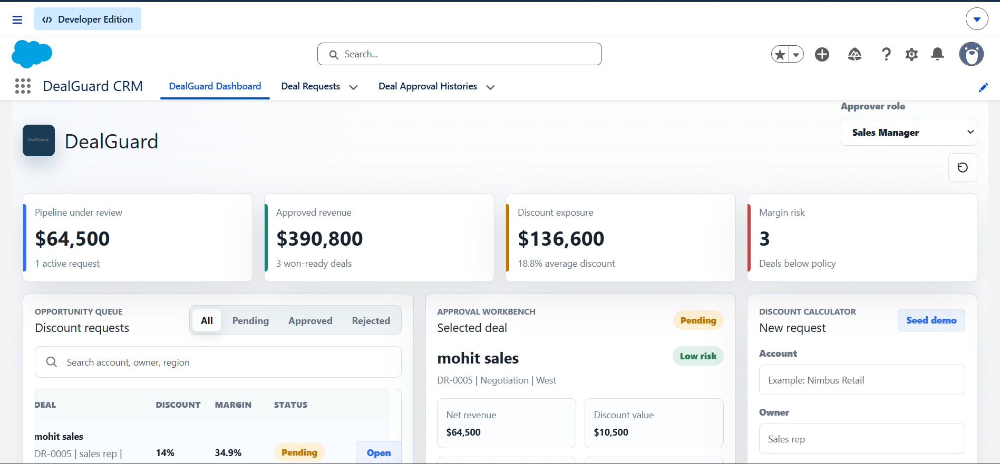
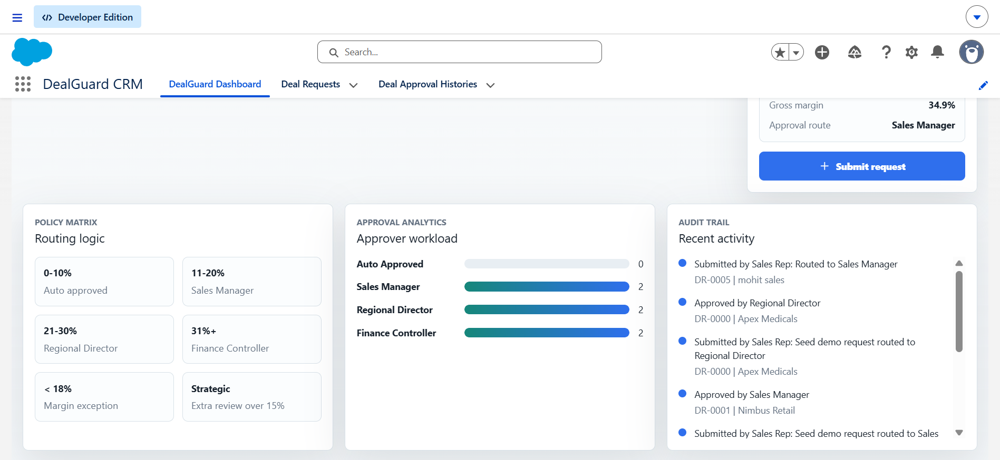

# DealGuard

## Revenue Intelligence & Discount Approval Platform

DealGuard is a Salesforce application designed to help organizations manage discount approvals, reduce revenue leakage, and maintain pricing discipline through automated workflows, approval routing, and risk-based decision making.

Built using Salesforce platform technologies including Apex, Lightning Web Components (LWC), Flow Automation, and Experience Cloud, DealGuard simulates a real-world enterprise approval process used by sales and revenue operations teams.

---

## Business Problem

Sales teams often offer discounts to close deals quickly, which can lead to:

* Reduced profit margins
* Inconsistent approval processes
* Lack of visibility into discount exposure
* Missing audit trails and accountability

DealGuard addresses these challenges by introducing a centralized approval workflow with automated policy checks, approval routing, and activity tracking.

---
## Screenshots

### Revenue Intelligence Dashboard



The dashboard provides a centralized view of deal requests, revenue exposure, approval status, and risk indicators, helping stakeholders monitor deal performance in real time.

### Deal Approval Workbench



Managers can review submitted deals, analyze financial impact, approve or reject requests, and maintain a complete approval audit trail through a streamlined approval interface.
---

## Key Features

### Deal Approval Management

* Create and manage discount requests
* Submit deals for approval
* Approve or reject requests with comments
* Track approval status throughout the lifecycle

### Automated Risk Assessment

* Evaluate discount percentage against business policies
* Assign risk levels automatically
* Route deals to appropriate approvers

### Workflow Automation

* Record-Triggered Flows
* Automated approval routing
* Approval history creation
* Status updates and notifications

### Email Notifications

* Notify approvers when new requests are submitted
* Notify sales representatives when requests are approved or rejected
* Automated communication throughout the approval process

### Approval Audit Trail

* Complete approval history tracking
* Action logging
* Decision comments and timestamps
* Enhanced accountability and transparency

### Experience Cloud

* Customer and partner-facing experience
* Secure external access
* Responsive user interface

### Interactive Dashboard

* Revenue visibility
* Deal monitoring
* Approval workbench
* Pipeline insights

---

## Technology Stack

| Technology                     | Purpose                   |
| ------------------------------ | ------------------------- |
| Salesforce Platform            | Core Application          |
| Apex                           | Business Logic            |
| Lightning Web Components (LWC) | User Interface            |
| Flow Builder                   | Process Automation        |
| Experience Cloud               | External User Access      |
| Salesforce CLI                 | Deployment & Development  |
| Validation Rules               | Data Integrity            |
| Permission Sets                | Security & Access Control |

---

## Architecture Overview

```text
Sales Rep
    │
    ▼
Create Deal Request
    │
    ▼
Policy Evaluation
(Apex + Flow)
    │
    ▼
Risk Assessment
    │
    ▼
Approver Assignment
    │
    ▼
Approval Decision
    │
 ┌──┴──┐
 ▼     ▼
Approve Reject
 │       │
 ▼       ▼
Email Notifications
 │
 ▼
Approval History Tracking
```

---

## Salesforce Components

### Custom Objects

* Deal_Request__c
* Deal_Approval_History__c

### Automation

* Record Triggered Flow
* Invocable Apex Actions
* Email Automation

### Security

* Permission Sets
* Role-Based Access

### Development

* Apex Controllers
* Apex Test Classes
* Lightning Web Components

---

## Deployment

Deploy the application using Salesforce CLI:

```bash
sf project deploy start --source-dir force-app --test-level RunLocalTests
```

---

## Project Outcomes

* Automated enterprise approval workflow
* Improved visibility into discount exposure
* Centralized approval management
* Full approval audit trail
* Scalable Salesforce architecture
* Production-style deployment process

---

## Author

**Mohit Sharma**

Salesforce Developer Portfolio Project

Built using Apex, LWC, Flow Automation, Experience Cloud, and Salesforce CLI.
